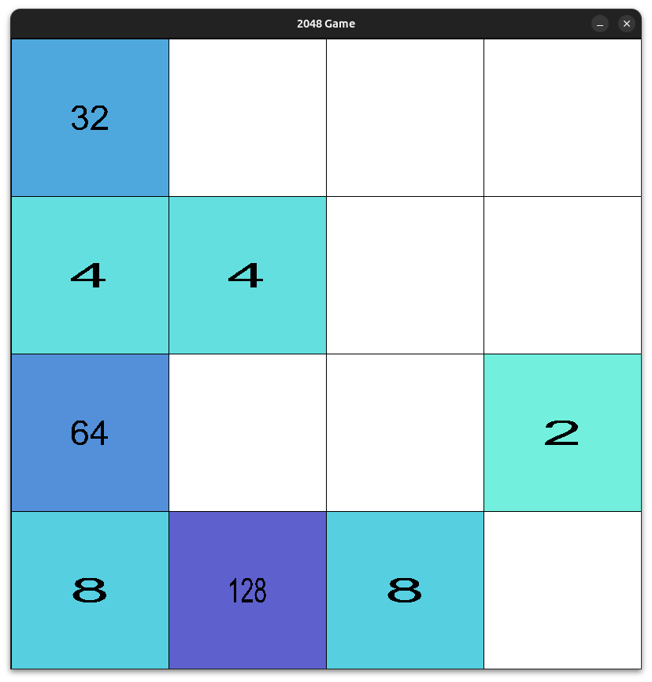

# asm-2048

This project is an implementation of the game 2048 using C for graphics and NASM for the core functionalities of the game. The graphics are implemented using SDL2 and the logic of the game is implemented in assembly.

## Use this to run with the Bash script:

- `chmod +x run.sh`
- `./run.sh`

The bash script will compile the C code as well as the NASM code, execute it and then clean up aftwerwards.

## Dependencies

The following dependencies have to be installed in order for the graphics to function.

- `sudo apt-get install libsdl2-dev`
- `sudo apt-get install libsdl2-ttf-dev`

## Screenshot

